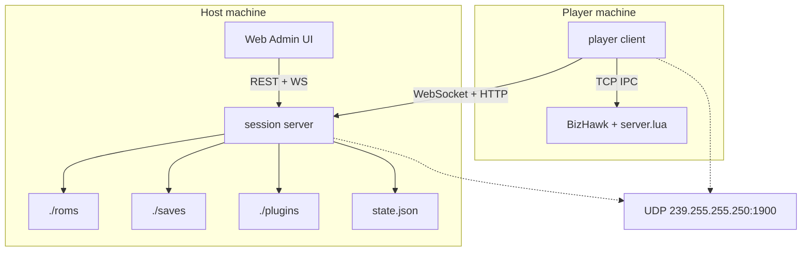
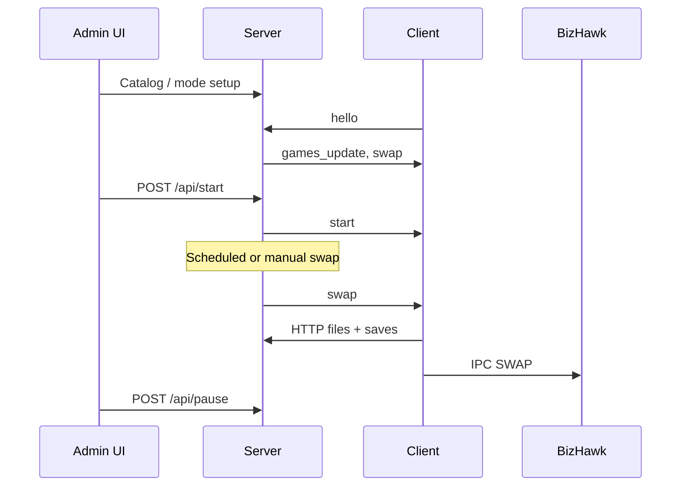

# BizShuffle — Product & Technical Specification (Go)

Unified specification for **BizShuffle**: a coordinated retro-gaming session host that manages multiple BizHawk emulator clients. This document merges architecture, protocol, UX/deployment, and game-mode/plugin coverage from this repository (`cmd/`, `serverhost/`, `clienthost/`, `assets/server.lua`, runtime data dirs). Behavior described here reflects **implemented code** in this repo.

---

## Table of Contents

1. [Executive Summary](#1-executive-summary)
2. [Product Goals & Constraints](#2-product-goals--constraints)
3. [System Architecture](#3-system-architecture)
4. [Components & Boundaries](#4-components--boundaries)
5. [User Experience & Deployment](#5-user-experience--deployment)
6. [Communication Protocol](#6-communication-protocol)
7. [REST API Reference](#7-rest-api-reference)
8. [Game Modes & Save Orchestration](#8-game-modes--save-orchestration)
9. [Plugin System](#9-plugin-system)
10. [State & Persistence](#10-state--persistence)
11. [Build, Release & Operations](#11-build-release--operations)
12. [Troubleshooting](#12-troubleshooting)
13. [Source File Index](#13-source-file-index)

---

## 1. Executive Summary

BizShuffle is a **single-session** coordination server for groups playing through **BizHawk** emulators. One **server** process is the session authority: it schedules or triggers game swaps, distributes ROMs and save states over HTTP, and pushes real-time commands to **client** processes over WebSockets. Each client launches BizHawk locally, runs a Lua bridge (`server.lua`), and keeps the emulator in sync with the host.

| Layer           | Transport                     | Participants                            |
| --------------- | ----------------------------- | --------------------------------------- |
| Admin UI        | HTTP + WebSocket (`/ws`)      | Browser ↔ session server                |
| Player client   | HTTP + WebSocket (`/ws`)      | Player client ↔ session server          |
| BizHawk control | TCP line protocol (localhost) | Player client ↔ `server.lua` in BizHawk |

**Primary deployment:** LAN parties with UDP multicast discovery; Internet play uses manual server URLs and port forwarding. **No authentication** — players identify by username only.

---

## 2. Product Goals & Constraints

| Goal                   | Implementation                                                        |
| ---------------------- | --------------------------------------------------------------------- |
| One session per server | No multi-tenant routing                                               |
| Minimal ops            | Human-editable `state.json`, plugin `*.kv` files; no database         |
| Trusting networks      | Username-only identity; permissive WebSocket origins                  |
| Host-controlled flow   | Web admin + optional swap timer; players mostly passive after connect |
| WebSocket + HTTP split | Real-time commands over WS; ROMs/saves/plugins over HTTP              |

**Not implemented (or stubbed):**

- `POST /api/reset` — use pause, clear saves, and player management instead.
- **Player-name hashing** for game assignment — save mode uses first-free instance, shuffled round-robin, and preference-based random selection.
- **`fullscreen_toggle`**, **`check_config`**, **`update_config`** on the player client — ack-only stubs (no Alt+Enter, no config probe yet).
- **`discovery_enabled`**, **`discovery_timeout_seconds`**, **`auto_open_bizhawk`** in `config.json` — defaults are written but not read by current runtime code.
- **Separate player CLI binary** — not shipped; use `cmd/desktop` **Join** for BizHawk + WebSocket player.

---

## 3. System Architecture

### 3.1 Component overview

| Component         | Artifact                                                         | Role                                                                                      |
| ----------------- | ---------------------------------------------------------------- | ----------------------------------------------------------------------------------------- |
| **Server**        | `cmd/server`, `serverhost/`                                      | HTTP API, admin UI, ROM/save/plugin serving, WebSocket hub, swap scheduler, LAN discovery |
| **Player client** | `clienthost/` (library)                                          | WebSocket client, downloads, plugins; used by desktop Join                                |
| **BizHawk + Lua** | `EmuHawk` + `server.lua`                                         | Emulation, swap/save, plugin hooks; TCP to player client on localhost                     |
| **Web admin**     | `frontend/admin/` → `serverhost/static/`                         | React SPA; REST + admin WebSocket                                                         |
| **Desktop shell** | `cmd/desktop` (Fyne)                                             | **Host** (embedded server + admin), **Join** (deps panel + BizHawk + player client)       |
| **Plugins**       | `plugins/*`                                                      | Lua extensions; server is source of truth, clients sync files                             |



### 3.2 Directory layout

```
BizShuffle3/
├── cmd/server, desktop/
├── protocol/, domain/, savestate/, serverhost/, clienthost/, testing/
├── frontend/admin/, assets/server.lua
├── roms/, saves/, plugins/, state.json, config.json, BizHawk/   (runtime, ~/BizShuffle)
└── docs/SPEC.md, docs/contracts/
```

**Package direction:** `cmd/*` → `serverhost` / `clienthost` → `domain` + `protocol`. Server and client packages do not import each other.

### 3.3 Deployment topology

**LAN:** Server binds `host`/`port` (flags, `state.json`, or default `127.0.0.1:8080`). UDP discovery on `239.255.255.250:1900` plus loopback `127.0.0.1:1901`. Firewall: inbound TCP on server port (default **8080**).

**Internet:** Manual `http://` / `ws://` URLs; no built-in TLS. HTTPS/WSS only if user fronts with a proxy or uses ports 443/8443. Multicast discovery does not cross NAT.

### 3.4 Concurrency model

| Process | Mechanism                                                                                                              |
| ------- | ---------------------------------------------------------------------------------------------------------------------- |
| Server  | Goroutines + `net/http`; mutex/debounced persistence in `serverhost`; per-WS handlers; swap scheduler; discovery broadcaster |
| Client  | WS reconnect loop; `Controller` handles swap/downloads; `BizhawkIpc` TCP client with ACK timeout                       |
| Lua     | Single-threaded frame loop; synchronous IPC handling                                                                   |

### 3.5 Key design tradeoffs

- **Ack/nack with optional `sendAndWait` (20s)** — not all paths block on ack.
- **Debounced `state.json` saves** — crash within 500ms may lose last writes.
- **Plugins stripped from persisted state** — reloaded from `./plugins/` at start; save blocked if any plugin status is `error`.
- **Dynamic Lua IPC port** — `lua_server_port.txt` written before BizHawk launch; client dials Lua listener.

---

## 4. Components & Boundaries

### 4.1 Server (`serverhost/`)

**Owns:** Session lifecycle, player registry, game catalog, WebSocket routing, game-mode handlers, plugin metadata, debounced persistence, discovery broadcast.

**Does not own:** BizHawk process; receives `lua_command` from clients and may trigger swap actions.

### 4.2 Client (`clienthost/`)

**Owns:** `config.json` (desktop shell + player runtime keys), WebSocket client, `Controller` (downloads, swaps, plugins), `BizhawkIpc`, `PluginSyncManager`, desktop entrypoints.

**Does not own:** Authoritative game assignment (executes server `swap` payload).

### 4.3 BizHawk / `server.lua`

**Owns:** ROM load (`./roms`), saves (`./saves`), plugin hooks (`on_init`, `on_frame`, `on_settings_changed`), TCP listener (default port **55355**).

**Exposes to plugins:** `SendCommand`, `csv_to_array`, `InstanceID`, `console.log`.

### 4.4 Web admin (`frontend/admin/`)

**Owns:** Session controls, players, games/instances (mode-dependent), plugins, messaging, config check UI.

**Does not own:** Business rules (server enforces).

### 4.5 Desktop app (`cmd/desktop`)

**Owns:** Fyne shell, embedded server for **Host**, dependencies panel + `StartJoinSession` for **Join**, managed BizHawk under `{dataDir}/BizHawk`.

**Does not own:** Session authority (delegates to embedded or remote server).

---

## 5. User Experience & Deployment

### 5.1 Personas

| Persona    | Surfaces                        | Responsibilities                                       |
| ---------- | ------------------------------- | ------------------------------------------------------ |
| **Host**   | Browser `http://<host>:<port>/` | ROM catalog, session control, firewall, swaps, plugins |
| **Player** | Desktop app **Join**            | Connect with username; keeps BizHawk + client running    |

### 5.2 Platform requirements

| Platform              | Notes                                                                     |
| --------------------- | ------------------------------------------------------------------------- |
| **Windows** (primary) | BizHawk `EmuHawk.exe`; desktop app auto-downloads BizHawk when missing    |
| **Linux** (secondary) | Headless server; client CLI where supported                               |
| **Build**             | Go 1.26+; [Bun](https://bun.sh) for `make build-admin`; CGO for desktop (Fyne) |

### 5.3 Installation flows

**Desktop app (Host / Join):**

1. Data directory defaults to `%USERPROFILE%\BizShuffle\` (or `~/BizShuffle`).
2. **Host** — starts embedded `serverhost`, opens admin in a browser window. Does not launch BizHawk or the player client.
3. **Join** — blocked until the dependencies panel reports BizHawk (and VC++ on Windows) OK. User installs via **Install BizHawk** / **Install VC++** (downloads official BizHawk zip into `{dataDir}/BizHawk`). Then: reserve Lua port → `lua_server_port.txt` → launch `EmuHawk` with `server.lua` → WebSocket player connects to the server URL.
4. LAN discovery — shell lists discovered servers on refresh; user can pick a server or type a URL.

**Manual / headless:**

```text
go run ./cmd/server -- --data-dir ~/BizShuffle --host 127.0.0.1 --port 8080
go run ./cmd/desktop   # Host and/or Join with GUI
```

### 5.4 First-run configuration

**Client `config.json` keys:**

| Key                         | Default / notes                               |
| --------------------------- | --------------------------------------------- |
| `bind_host`                 | Desktop Host bind address (default `127.0.0.1`) |
| `host_port`                 | Desktop Host port (`0` = pick a free port)    |
| `server`                    | HTTP base; `ws://` normalized to `http://`    |
| `name`                      | Player name for `hello`                       |
| `bizhawk_path`              | Cached path to managed `EmuHawk` under `{dataDir}/BizHawk` (external paths are cleared) |
| `discovery_enabled`         | Default `"true"` — **not read** by current client runtime                               |
| `discovery_timeout_seconds` | Default `"5"` — **not read** by current client runtime                                  |
| `multicast_address`         | Default `239.255.255.250:1900` — **not read** by current client runtime                 |
| `auto_open_bizhawk`         | Default `"true"` — **not read** by current client runtime                               |

**LAN discovery:** Server broadcasts every 5s on UDP multicast (+ loopback `127.0.0.1:1901`). **Desktop** shell lists discovered servers and accepts manual URLs.

### 5.5 Web admin workflows

| Panel   | Key actions                                                                                            |
| ------- | ------------------------------------------------------------------------------------------------------ |
| Session | Start/pause, do swap, auto swaps, better random, countdown, clear saves, mode, interval                |
| Players | Add/remove, swap, random, message, fullscreen, config check, drag-drop instances (save mode)           |
| Games   | Catalog, auto setup (`POST /api/mode/setup`), sync checkboxes, instances (save mode), open roms folder |
| Plugins | Enable/disable, reload, settings modal, open plugins folder                                            |
| Logs    | Local action log (200 entries)                                                                         |

### 5.6 Client UI

Desktop shell: bind host/port, **Host (server + admin)**, server URL, player name, dependencies panel, **Join**. BizHawk launches only on Join after dependencies are satisfied.

### 5.7 Session lifecycle



---

## 6. Communication Protocol

### 6.1 WebSocket transport

| Property       | Value                                                                   |
| -------------- | ----------------------------------------------------------------------- |
| Endpoint       | `GET /ws`                                                               |
| Read limit     | 16 KiB                                                                  |
| Read deadline  | 60s (reset on Pong)                                                     |
| Outbound queue | 256 per connection                                                      |
| Keepalive      | Ping frames every 30s; JSON `ping` cmd sent as **Ping frame**, not JSON |

### 6.2 Message envelope

```json
{
  "cmd": "<command>",
  "id": "<uuid>",
  "payload": {}
}
```

### 6.3 Ack/Nack contract

1. Server may register `pending[id]` and `sendAndWait` (20s timeout for `swap`).
2. Client responds `{ "cmd": "ack"|"nack", "id": "<same>", "payload": { "reason": "..." } }`.
3. Special cases: `games_update` → separate `games_update_ack`; `hello` completes on first `games_update`.

### 6.4 Server → client commands

| Command       | JSON `cmd`          | Purpose                                                          |
| ------------- | ------------------- | ---------------------------------------------------------------- |
| Resume        | `start`             | Unpause BizHawk                                                  |
| Pause         | `pause`             | Pause BizHawk                                                    |
| Swap          | `swap`              | Payload: `game`, optional `instance_id`                          |
| Message       | `message`           | Overlay: `message`, `duration`, `x`, `y`, `fontsize`, `fg`, `bg` |
| Games update  | `games_update`      | `games`, `main_games`, `game_instances`                          |
| Clear saves   | `clear_saves`       | Wipe local saves                                                 |
| Request save  | `request_save`      | Payload: `instance_id`                                           |
| Plugin reload | `plugin_reload`     | Payload: `plugin_name`                                           |
| Fullscreen    | `fullscreen_toggle` | Alt+Enter (Windows)                                              |
| Check config  | `check_config`      | Payload: `config_keys[]`                                         |
| Update config | `update_config`     | Payload: `config_updates` (JSON string)                          |
| State update  | `state_update`      | Plugin settings to players; `updated_at` to admins               |

### 6.5 Client → server messages

| Command            | Purpose                                                     |
| ------------------ | ----------------------------------------------------------- |
| `hello`            | `name`, `bizhawk_ready` — triggers games_update, swap, ping |
| `ack` / `nack`     | Command correlation                                         |
| `games_update_ack` | `has_files`, optional `errors[]`                            |
| `status_update`    | `bizhawk_ready` changes                                     |
| `lua_command`      | Parsed `LuaCommand`: `swap`, `swap_me`, `message`           |
| `config_response`  | Reply to `check_config`                                     |

### 6.6 Admin WebSocket

- `hello_admin` with `name` → registered in `adminClients`.
- Receives `state_update` (`updated_at`), mirrored player commands, `lua_command` broadcasts.

### 6.7 BizHawk Lua IPC (localhost)

**Controller → Lua:** `CMD|{id}|{COMMAND}|{args...}`

| COMMAND                             | Effect                                    |
| ----------------------------------- | ----------------------------------------- |
| `SAVE`                              | Save to `./saves/{instance or rom}.state` |
| `SWAP` / `LOAD`                     | Load ROM + save                           |
| `PAUSE` / `RESUME`                  | Emulation control                         |
| `MSG`                               | On-screen text                            |
| `PLUGIN_SETTINGS` / `PLUGIN_RELOAD` | Plugin lifecycle                          |
| `AUTOSAVE`                          | `true` / `false` (10s interval in Lua)    |

**Lua → controller:** `HELLO`, `ACK|id`, `NACK|id|reason`, `PING|ts`, `CMD|{kind}|{key=val;...}`

**Timeout:** 10s per IPC command. Port: free port from 55355, written to `lua_server_port.txt` before BizHawk starts; client connects as TCP client.

### 6.8 Discovery (UDP)

**Broadcast (`DiscoveryMessage`):**

```json
{
  "type": "bizshuffle_server",
  "version": "1.0",
  "server_name": "<hostname> Server",
  "host": "<ip>",
  "port": 8080,
  "timestamp": "<RFC3339>",
  "server_id": "<host>:<port>"
}
```

- Multicast `239.255.255.250:1900` every 5s; copy to `127.0.0.1:1901`.
- Valid if timestamp within **30 seconds**.
- Client WebSocket URL: `ws://{host}:{port}/ws`.

---

## 7. REST API Reference

Base: `http://{host}:{port}`. Most mutations return plain `"ok"` or JSON as noted.

### 7.1 Session & scheduling

| Method   | Path                            | Body                   | Effect                                   |
| -------- | ------------------------------- | ---------------------- | ---------------------------------------- | --------- |
| POST     | `/api/start`                    | —                      | `running=true`; broadcast `start`        |
| POST     | `/api/pause`                    | —                      | `running=false`; broadcast `pause`       |
| POST     | `/api/clear_saves`              | —                      | Trash `./saves`; broadcast `clear_saves` |
| POST     | `/api/toggle_swaps`             | —                      | Toggle `swap_enabled`                    |
| POST     | `/api/toggle_countdown`         | —                      | Toggle 3-2-1 before auto swap            |
| POST     | `/api/toggle_prevent_same_game` | —                      | Toggle better random                     |
| POST     | `/api/do_swap`                  | —                      | Async full swap                          |
| POST     | `/api/random_swap`              | `{ "player": "name" }` | Per-player random swap                   |
| GET/POST | `/api/mode`                     | `{ "mode": "sync"      | "save" }`                                | Game mode |
| POST     | `/api/mode/setup`               | —                      | Scan `./roms/`, setup catalog            |
| GET/POST | `/api/interval`                 | min/max seconds        | Scheduler bounds                         |

### 7.2 Games & players

| Method      | Path                                    | Notes                                           |
| ----------- | --------------------------------------- | ----------------------------------------------- |
| GET         | `/api/games`                            | `main_games`, `game_instances`, `games`         |
| POST        | `/api/games`                            | Partial state update + `games_update` broadcast |
| POST        | `/api/swap_player`                      | `{ player, game?, instance_id? }`               |
| POST        | `/api/swap_all_to_game`                 | `{ game }`                                      |
| POST        | `/api/add_player`, `/api/remove_player` | Player registry                                 |
| POST/DELETE | `/api/players/{player}/completed_*`     | Completion tracking                             |

### 7.3 Messaging & config

| Method | Path                                                    |
| ------ | ------------------------------------------------------- |
| POST   | `/api/message_player`, `/api/message_all`               |
| POST   | `/api/fullscreen_toggle`                                |
| POST   | `/api/check_player_config`, `/api/update_player_config` |
| POST   | `/api/set_config_keys`                                  |

### 7.4 Plugins

| Method   | Path                                                    |
| -------- | ------------------------------------------------------- |
| GET      | `/api/plugins`, `/api/plugins/{name}`                   |
| GET/POST | `/api/plugins/{name}/settings` (POST requires `status`) |
| POST     | `/api/plugins/{name}/reload`                            |
| DELETE   | `/api/plugins/{name}`                                   |
| POST     | `/api/open_plugins_folder`, `/api/open_roms_folder`     |

### 7.5 Files & state

| Method | Path                    | Notes                              |
| ------ | ----------------------- | ---------------------------------- |
| GET    | `/files/list.json`      | ROM listing                        |
| GET    | `/files/{path}`         | Download from `./roms/`            |
| GET    | `/files/plugins/{path}` | Plugin files                       |
| POST   | `/upload`               | Multipart `file` → `./roms/`       |
| GET    | `/save/{filename}`      | Save download (30s wait for ready) |
| POST   | `/save/upload`          | Multipart save                     |
| POST   | `/save/no-save`         | Form `instance_id` → `none`        |
| GET    | `/state.json`           | `{ "state": ServerState }`         |
| GET    | `/`                     | Admin UI                           |

---

## 8. Game Modes & Save Orchestration

### 8.1 Mode comparison

| Aspect                  | Sync (`sync`)                 | Save (`save`)                                |
| ----------------------- | ----------------------------- | -------------------------------------------- |
| Same game for all       | Yes                           | No — per instance                            |
| `instance_id` on swap   | Empty                         | Required                                     |
| Save HTTP orchestration | Minimal                       | Core                                         |
| Selection               | `SwapSeed` + `selectNextGame` | Instance shuffle + preference tiers          |
| Setup                   | Merges `main_games` → `games` | Creates `GameSwapInstance` per catalog entry |

Handlers: sync and save mode logic in `serverhost/` (`game_modes.go`).

### 8.2 Sync mode behavior

- `HandleSwap`: one game for all connected players; respects `CompletedGames` and `PreventSameGameSwap`.
- `GetPlayer`: uses existing group game or seeds from `games` list.
- Clears `InstanceID` on every assignment.

### 8.3 Save mode behavior

**`GameSwapInstance`:** `id`, `game`, `file_state` (`none`|`pending`|`ready`), `pending_player`.

- `HandleSwap`: `SetPendingAllFiles`, shuffle instances, round-robin assign via `findAvailableInstanceForPlayer`.
- `HandlePlayerSwap`: requires `instance_id`; may re-swap previous owner.
- `HandleRandomSwapForPlayer`: may chain through previous instance owners.

**Save client pipeline on `swap`:**

1. `AUTOSAVE false` → download ROM → save current → `EnsureSaveState` (async upload old, sync download new) → `SendSwap` → `AUTOSAVE true`.

### 8.4 Swap scheduler

Runs when `running && swap_enabled`:

1. Random interval in `[min_interval_secs, max_interval_secs]` (defaults 5–10 in new server; fallback **300s** if both zero).
2. Optional countdown (`countdown_enabled`, interval ≥ 3s): messages 3, 2, 1 then `performSwap()`.
3. `schedulerCh` wakes loop on start/pause/toggle.

**Manual triggers:** `/api/do_swap`, `/api/random_swap`, `/api/swap_player`, Lua `swap` / `swap_me`.

---

## 9. Plugin System

### 9.1 Directory structure

```
plugins/{name}/
├── plugin.lua      # return { on_init, on_frame, on_settings_changed }
├── meta.kv         # read-only metadata + setting.* UI hints
├── settings.kv     # status=enabled|disabled + custom keys
└── README.md
```

### 9.2 Lifecycle

1. **Server load:** scan `./plugins/`; load each plugin from `meta.kv` + `settings.kv` (create `settings.kv` with `status=disabled` if missing).
2. **Client sync:** `GET /api/plugins` → download all plugin dirs from `/files/plugins/` → remove orphans.
3. **Enable/disable:** `POST .../settings` → broadcast `state_update` → client writes `settings.kv` → IPC `PLUGIN_SETTINGS`.
4. **Reload:** `POST .../reload` → `plugin_reload` → full sync + IPC `PLUGIN_RELOAD`.

Only `status=enabled` plugins load in BizHawk.

### 9.3 Bundled plugins

| Plugin           | Behavior                                                             |
| ---------------- | -------------------------------------------------------------------- |
| `example-plugin` | Template hooks                                                       |
| `mario-lives`    | SMB3 lives RAM hack every 300 frames                                 |
| `memory-tracker` | Per-ROM memory watches; `SendCommand(swap\|swap_me)` on value change |

### 9.4 Lua → server bridge

Plugins call `SendCommand(kind, fields)` → client forwards `lua_command` → server:

| Kind      | Server action                        |
| --------- | ------------------------------------ |
| `swap`    | `performSwap()`                      |
| `swap_me` | `performRandomSwapForPlayer(sender)` |
| `message` | Broadcast to all players/admins      |

---

## 10. State & Persistence

### 10.1 Server `state.json`

| Field area                                                 | Purpose                                              |
| ---------------------------------------------------------- | ---------------------------------------------------- |
| `running`, `swap_enabled`, `mode`                          | Session control                                      |
| `host`, `port`                                             | Bind hints                                           |
| `min/max_interval_secs`, `next_swap_at`                    | Scheduler                                            |
| `main_games`, `games`, `game_instances`                    | Catalog                                              |
| `players`                                                  | Per-player game, instance, ping, completions, config |
| `prevent_same_game_swap`, `countdown_enabled`, `swap_seed` | Swap behavior                                        |
| `plugins`                                                  | In-memory only; **omitted on save**                  |

Write: debounced 500ms via `saveChan`. Load: all players `connected: false` until `hello`.

### 10.2 Client `config.json`

String map in the client data directory. Desktop shell fields (`bind_host`, `host_port`, `server`, `name`) and player runtime keys (`bizhawk_path`, …) share this file. See §5.4.

### 10.3 Ephemeral state

Server: WebSocket maps, `pending` ack channels. Client: download progress, IPC ready flag. Lua: `loaded_plugins`.

---

## 11. Build, Release & Operations

### 11.1 Build scripts

| Script                | Output                                           |
| --------------------- | ------------------------------------------------ |
| `make build-admin`     | React admin → `serverhost/static/`            |
| `go run ./cmd/server`  | Headless server                               |
| `go run ./cmd/desktop` | Fyne desktop (Host + Join)                    |
| `make test`            | Go packages listed in `go.work`               |

### 11.2 CI

GitHub Actions workflows under `.github/workflows/` (lint, test, release as configured).

### 11.3 Network requirements

| Traffic          | Port / protocol                                                 |
| ---------------- | --------------------------------------------------------------- |
| HTTP + WebSocket | TCP **8080** (default) inbound on host                          |
| Discovery        | UDP multicast `239.255.255.250:1900`; loopback `127.0.0.1:1901` |

**Security:** No TLS by default; no auth; any reachable client can use admin UI. Deploy on trusted networks or restrict by firewall/VPN.

### 11.4 Runtime layout

- **Server data dir:** `roms/`, `saves/`, `plugins/`, `state.json` (default under `~/BizShuffle` or `--data-dir`).
- **Client data dir:** `config.json`, `lua_server_port.txt`, local `roms/`, `saves/`, `plugins/` synced from host.

---

## 12. Troubleshooting

| Symptom               | Check                                                                         |
| --------------------- | ----------------------------------------------------------------------------- |
| Cannot find server    | Same LAN; manual `http://HOST:8080`; firewall TCP 8080; server `0.0.0.0` bind |
| Discovery empty       | Multicast blocked; use manual URL; server discovery logs                      |
| Admin UI broken       | Run server from dir containing `web/`                                         |
| Client disconnected   | `curl http://host:port/state.json`; verify WS URL                             |
| BizHawk not launching | Install via desktop deps panel; `bizhawk_path` must be under `{dataDir}/BizHawk` |
| Games not loading     | ROMs in host `./roms/`; catalog; sync mode game checkboxes                    |
| Save swap failures    | `file_state` stuck `pending`; client logs; file locks on Windows              |
| Plugin not applied    | Admin status; client plugin sync logs                                         |

**Logs:** Client `logs/` (with `-v`); server stdout; admin Logs panel.

**Recovery:** Delete/edit `config.json` or `state.json` while stopped.

---

## 13. Source File Index

| Area             | Primary files                                                                              |
| ---------------- | ------------------------------------------------------------------------------------------ |
| Server entry     | `cmd/server`, `serverhost/server.go`                                                       |
| Desktop entry    | `cmd/desktop`, `cmd/desktop/fyneapp/`                                                      |
| Desktop Join     | `cmd/desktop`, `clienthost/join_session.go`                                                |
| Types / protocol | `protocol/schemas.go`, `codec.go`, `kv.go`, `lua_plugin.go`                                |
| Domain session   | `domain/session.go`                                                                        |
| WebSocket        | `serverhost/ws.go`, `clienthost/wsclient.go`, `clienthost/controller.go`                   |
| REST routes      | `serverhost/server.go`, `serverhost/api_*.go`                                              |
| Game modes       | `serverhost/game_modes.go`                                                                 |
| Saves            | `serverhost/api_saves.go`, `clienthost/api.go`, `savestate/verify.go`                      |
| Plugins          | `serverhost/api_plugins.go`, `clienthost/plugin_sync.go`                                   |
| Discovery        | `serverhost/discovery_broadcaster.go`, `clienthost/discovery_listener.go`                  |
| BizHawk IPC      | `clienthost/bizhawk_ipc.go`, `assets/server.lua`                                           |
| Admin UI         | `frontend/admin` (build → `serverhost/static/`)                                            |
| Tests            | `testing/arch`, `testing/integration`, `testing/protocol`                                  |
| User guide       | `README.md`                                                                                |

---

_Unified spec — reflects repository implementation. For quick-start user instructions, see `README.md`._
